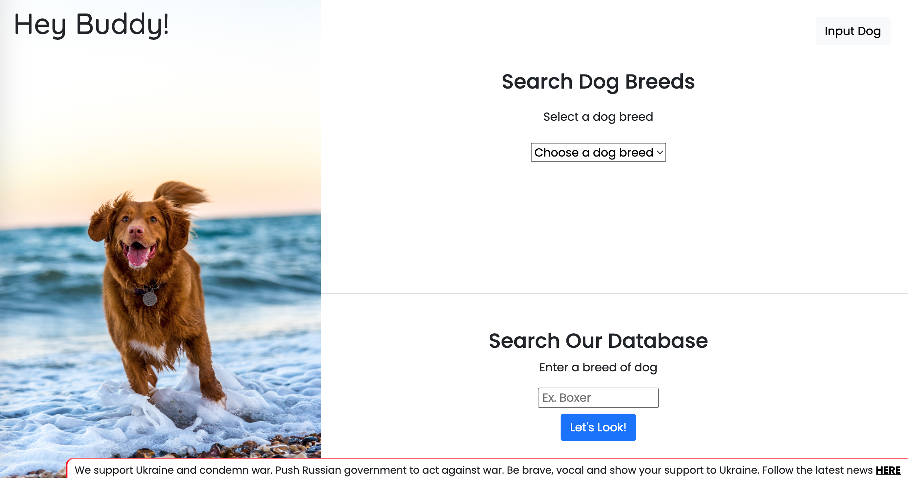

# Hey Buddy PHP MySQL Dog Search & Input Website

Site created with Bootstrap5, CSS3, JavaScript, PHP, & MySQL. Deployed with 000webhostapp.com.

## Table of contents

- [Screenshots](#screenshots)
- [Technologies](#technologies)
- [Live Demo](#live-demo)
- [Contact](#contact)

## Screenshots

## Technologies

- Bootstrap5, CSS3, JavaScript, PHP, & MySQL. Deployed with 000webhostapp.com..

## Live Demo

View live demo here: [Demo](https://thatsmydog.000webhostapp.com/)

## Contact

Created by [Ibsaa J Adam](https://github.com/ibsaajadam) - feel free to contact on:
You can find me also on:

- [Linkedin](https://www.linkedin.com/in/ibsaajadam/)
- [Github](https://github.com/ibsaajadam)
